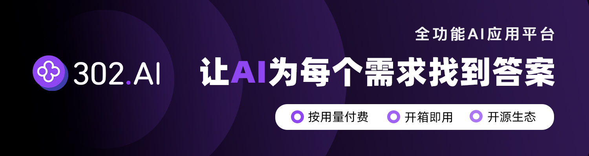

🌍 *[English](README.md) ∙ [简体中文](README-zh.md)*

<a href="https://gpt302.saaslink.net/Y3CmW1" target="_blank">
  
</a>

> [Sponsor - 赞助]  
> <a href="https://gpt302.saaslink.net/Y3CmW1" target="_blank">302.AI</a>是一个按需付费的一站式AI应用平台，开放平台，开源生态。
>
> 1.集合了最新最全的AI模型和品牌，包括但不限于语言模型、图像模型、声音模型、视频模型。  
> 2.在基础模型上进行深度应用开发，做到让小白用户都可以零门槛上手使用，无需学习成本。  
> 3.零月费，所有功能按需付费，全面开放，做到真正的门槛低，上限高。  
> 4.创新的使用模式，管理和使用分离，面向团队和中小企业，一人管理，多人使用。  
> 5.所有AI能力均提供API接入，所有应用开源支持自行定制（进行中）。  
> 6.强大的开发团队，每周推出2-3个新应用，平台功能每日更新。  
>
> 302.AI开源工具啦：<https://github.com/302ai>

# [SmartExcel.cc](https://www.smartExcel.cc/)

Generate the Excel formulas you need in seconds using AI.

[](https://www.smartExcel.cc/)

## How it works

This project uses the [ChatGPT API](https://openai.com/api/) and the [Vercel AI SDK](https://sdk.vercel.ai/docs) with streaming. It constructs a prompt based on the form and user input, sends it to the ChatGPT API with a Vercel Edge Function, then streams the response back to the application UI.

## Stack

SmartExcel is built on the following stack:

- Next.js – Frontend/Backend
- TailwindCSS – Styles
- Postgres and Prisma - database and storage([How to use?](https://weijunext.com/article/061d8cd9-fcf3-4d9e-bd33-e257bc4f9989))
- Next-auth - Authentication([How to use?](https://weijunext.com/article/061d8cd9-fcf3-4d9e-bd33-e257bc4f9989))
- ChatGPT - Generate the Excel formulas
- Upstash - Redis([How to use?](https://weijunext.com/article/6510121c-90da-4d20-85a1-72cbbdb3983b))
- Lemon Squeezy - payments([How to use?](https://weijunext.com/article/integrate-lemonsqueezy-api))
- Google Analytics - Analytics([How to use?](https://weijunext.com/article/979b9033-188c-4d88-bfff-6cf74d28420d))
- Docker - Development Storage([How to use?](https://weijunext.com/article/b33a5545-fd26-47a6-8641-3c7467fb3910))
- Vercel - Hosting

If you are unfamiliar with some of the tech stacks, please click on the "How to use" links above to read my Chinese blog, or visit my another public repo - [Learn Next.js Stack](https://github.com/weijunext/nextjs-learn-demos)

## Running Locally

After cloning the repo, you need to copy the `.env.example` file to create a `.env` file and fill in the required fields.

Open [Upstash](https://upstash.com/) and Create Redis application.

Then write `UPSTASH_REDIS_REST_URL` and `UPSTASH_REDIS_REST_TOKEN` to `.env`.

Then, run the application in the command line and it will be available at `http://localhost:3000`.

```bash
pnpm i

pnpm run dev
```

## One-Click Deploy

Deploy the example using [Vercel](https://vercel.com?utm_source=github&utm_medium=readme&utm_campaign=vercel-examples):

[](https://vercel.com/new/clone?repository-url=https://github.com/weijunext/smart-excel-ai&project-name=&repository-name=smart-excel-ai&demo-title=SmartExcel&demo-description=Generate%20the%20Excel%20formulas%20you%20need%20in%20seconds%20using%20AI.&demo-url=https://smartexcel.cc&demo-image=https://smartexcel.cc/opengraph-image.png)

## About Me

**Full-Stack Engineer, Open-Source Next.js Artist & AI Enthusiast.**

**全栈工程师，Next.js 开源手艺人，AI降临派。**

[My Blog](https://weijunext.com)  
[Github](https://github.com/weijunext)  
[Twitter/X - Zh](https://x.com/weijunext)  
[Twitter/X - En](https://x.com/judewei_dev)  
[Medium](https://medium.com/@weijunext)  
[掘金](https://juejin.cn/user/26044008768029)  
[知乎](https://www.zhihu.com/people/mo-mo-mo-89-12-11)  
[微信交流群](https://weijunext.com/make-a-friend)  

If this project is helpful to you, star the repo and buy be a coffee, thank you.

<a href="https://www.buymeacoffee.com/weijunext" target="_blank"></a>

<a href="https://afdian.net/a/weijunext" target="_blank"></a>


## Star History


# TaoismZen - Explore Taoist Arts & Culture

A modern web platform dedicated to sharing Taoist wisdom, metaphysical arts, and traditional Chinese practices with a global audience.

[Live Demo](https://taoismzen.com) | [中文文档](./README-zh.md)

## Overview

TaoismZen is a comprehensive platform designed to introduce Taoist culture and metaphysical arts to an international audience. Built with modern web technologies, it offers an accessible gateway to understanding Taoism's core principles, divination methods, and self-cultivation techniques.

## Key Features

### Content & Knowledge

- **Taoist Fundamentals**
  - Core philosophical concepts
  - Historical context and evolution
  - Modern applications and relevance

- **Metaphysical Arts**
  - BaZi (Four Pillars of Destiny)
  - Zi Wei Dou Shu (Purple Star Astrology)
  - Feng Shui
  - Traditional Chinese Dream Interpretation
  - Astrological Name Selection
  - Relationship Compatibility Analysis

### Technical Features

- 🎨 Modern, responsive UI built with Next.js 13
- 🌙 Dark mode support
- 🔍 Full-text search functionality
- 🌐 i18n ready (English primary, Chinese secondary)
- 🔒 Authentication with NextAuth.js
- 💾 Database integration with Prisma
- 📝 Content management with Contentlayer
- 🎯 TypeScript for type safety

## Getting Started

### Prerequisites

- Node.js 18+
- pnpm 8+
- PostgreSQL database

### Installation

\`\`\`bash

# Clone the repository

git clone <https://github.com/yourusername/taoismzen.git>

# Install dependencies

pnpm install

# Set up environment variables

cp .env.example .env.local

# Run database migrations

pnpm prisma migrate dev

# Start development server

pnpm dev
\`\`\`

### Environment Variables

Create a \`.env.local\` file with the following variables:

\`\`\`env

# App URLs

NEXT_PUBLIC_APP_URL=<http://localhost:3000>
NEXTAUTH_URL=<http://localhost:3000>

# Database

POSTGRES_PRISMA_URL=your_database_url

# Auth

NEXTAUTH_SECRET=your_secret_key
GITHUB_ID=your_github_id
GITHUB_SECRET=your_github_secret

# Optional: OAuth Providers

GOOGLE_ID=your_google_id
GOOGLE_SECRET=your_google_secret
\`\`\`

## Project Structure

\`\`\`
├── app/                 # Next.js 13 app directory
├── components/          # React components
├── config/             # Configuration files
├── content/            # Markdown/MDX content
├── lib/                # Utility functions
├── prisma/             # Database schema and migrations
├── public/             # Static assets
└── styles/             # Global styles
\`\`\`

## Contributing

We welcome contributions! Please see our [Contributing Guidelines](CONTRIBUTING.md) for details.

## License

This project is licensed under the MIT License - see the [LICENSE](LICENSE) file for details.

## Acknowledgments

- Built with [Next.js](https://nextjs.org/)
- Styled with [Tailwind CSS](https://tailwindcss.com/)
- Authentication by [NextAuth.js](https://next-auth.js.org/)
- Database ORM by [Prisma](https://www.prisma.io/)
- Content management with [Contentlayer](https://www.contentlayer.dev/)
